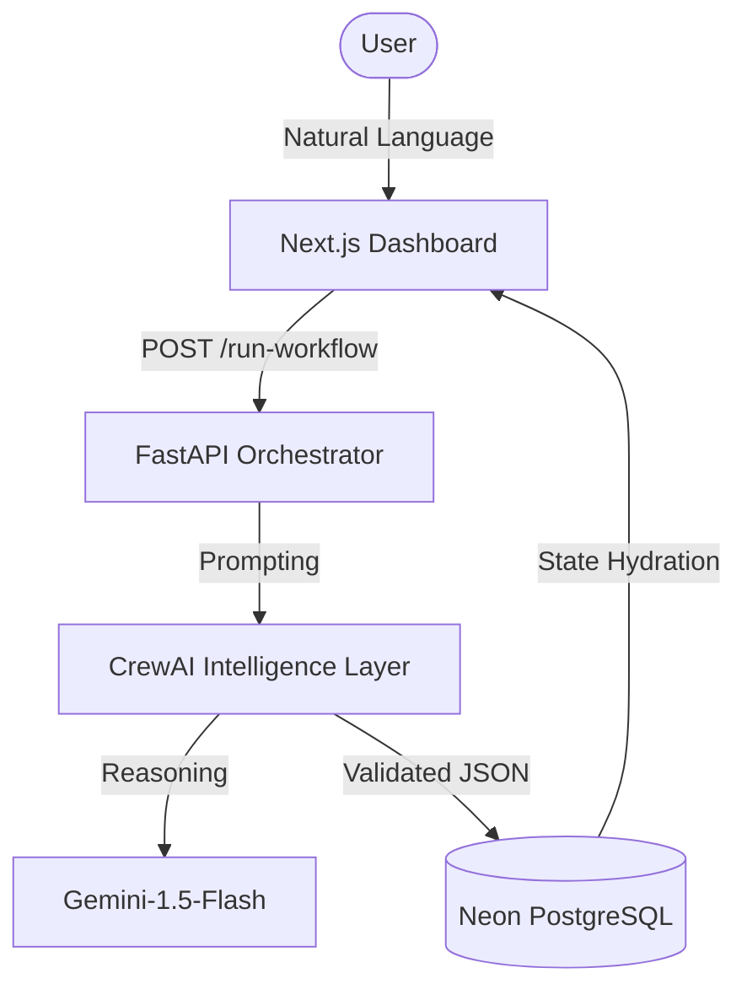

# AI-BOS: AI Business Operating System

AI-BOS is a production-ready, modular platform built with **CrewAI** that simulates a full company structure using specialized AI agents. It leverages structured JSON communication to ensure reliable, deterministic workflows between departments.

## 1. System Architecture
The system is divided into four main layers:
- **Agent Layer**: Specialized agents (Marketing, Sales, Finance, etc.) defined with specific roles and backstories.
- **Task Layer**: Atomic business tasks that enforce structured JSON output using Pydantic schemas.
- **Crew Orchestration Layer**: Groups of agents working together (e.g., Growth Crew, Strategy Crew) to solve complex business goals.
- **API/Storage Layer**: A FastAPI interface for triggering workflows and a JSON-based storage for persisting results.

## 2. Agent Collaboration Model
Agents follow a **Sequential Process**:
1.  **Research Agent** gathers data.
2.  **Strategy Agent** consumes the research to build a plan.
3.  **Growth/Ops Agents** execute tactical steps based on the plan.
4.  **Analytics Agent** validates the results.

## 3. JSON Communication Pipeline
Every task in AI-BOS is bound to a Pydantic schema. This ensures:
- **Interoperability**: One agent's output is perfectly formatted for the next agent's input.
- **Reliability**: LLM outputs are validated against a schema before being passed down the line.
- **Traceability**: All business decisions are stored as structured JSON records.

## 4. Workflow Examples
- **Lead Generation**: Research (Market) -> Marketing (Plan) -> Sales (Leads).
- **Strategy Formation**: Research -> Strategy (Key Results) -> Analytics (Projections).

## 5. How to Run Locally

### Prerequisites
- Python 3.10+
- OpenAI or Google Gemini API Key

### Installation
```bash
git clone <repo-url>
cd ai-bos-platform/backend
pip install -r requirements.txt
```

### Setup Environment
Create a `.env` file in `ai-bos-platform/backend`:
```env
OPENAI_API_KEY=your_key
OPENAI_MODEL_NAME=gpt-4o
```

### Running the API
```bash
python api/main.py
```
Then visit `http://localhost:8001/docs` to trigger workflows via Swagger UI.

## 6. How to Extend
To add a new department:
1.  **Define Schema**: Add a new Pydantic class in `schemas/business_schemas.py`.
2.  **Create Agent**: Add an agent definition in `agents/`.
3.  **Define Task**: Add a task in `tasks/` that uses the new schema.
4.  **Orchestrate**: Create a new Crew in `crews/` or add the agent to an existing one.

# 🚀 AI-BOSS: Autonomous Business Operating System

AI-BOSS is a professional-grade platform that orchestrates specialized AI agent teams to solve business challenges. By integrating **CrewAI** for multi-agent collaboration and a premium **Next.js** dashboard for visualization, it provides a seamless bridge between complex business objectives and actionable intelligence.

## 📁 Project Architecture (Primary Files)

```text
ai-BOSS-platform/
├── backend/                  # Python/FastAPI Orchestration Layer
│   ├── api/main.py           # Backend Entrypoint & Endpoint Definitions
│   ├── agents/               # Role-based Agent Definitions (CEO, Growth, etc.)
│   ├── crews/                # Crew Logic (Collaboration & Process Control)
│   ├── tasks/                # Atomic Tasks with Pydantic Schema mapping
│   ├── workflows/            # Sequential Multi-Crew Execution Pipelines
│   ├── schemas/              # Pydantic Output Validation Schemas
│   └── storage/              # Result Persistence & Data Management
├── dashboard/                # Next.js/React Visual Interface
│   ├── app/
│   │   ├── dashboard/page.tsx # "Command Center" Input Interface
│   │   ├── tasks/page.tsx     # Mission Vault (List View)
│   │   └── tasks/[id]/page.tsx # High-Fidelity Intelligence Reports
│   ├── components/Sidebar.tsx # Fixed Navigation System
│   └── lib/db/schema.ts      # Neon DB (PostgreSQL) Drizzle Schema
└── README.md                 # Project Documentation
```

## 🏗 System Architecture Layers

The AI-BOSS is built on a modular four-layer architecture:

1.  **Agent Layer**: Specialized experts (Market Analysts, Strategists, Lead Gen Specialists) with distinct roles and backstories.
2.  **Task Layer**: Atomic business deliverables that enforce **Strict JSON Validation** via Pydantic.
3.  **Orchestration Layer**: Hierarchical and Sequential Crews that manage the workflow and agent communication.
4.  **API & Delivery Layer**: A FastAPI-powered bridge that connects the intelligence engine to the React-based frontend.

## 🧠 Core Work Logic: Command to Intelligence

The process follows a deterministic pipeline to ensure business goals are transformed into verified data.

### 1. User Command Input
The user interacts with the **Command Center** dashboard:
- **Objective Input**: Users describe the mission in natural language (e.g., "Find high-intent AI startups in London").
- **Context Injection**: Industry-specific context is added to narrow the search space.

### 2. Intelligence Dispatch
Triggering "Start Task" initiates a multi-stage process:
- **Request Routing**: The Frontend sends a payload to the backend.
- **Crew Initialization**: The backend selects the appropriate **Crew** based on the objective intent.
- **Workflow Execution**: Agents collaborate using the **Sequential Process Model** (Research → Strategy → Action).

### 3. The JSON Communication Pipeline
To prevent "hallucinations" and ensure reliability, AI-BOSS uses a schema-bound pipeline:
- **Interoperability**: One agent's structured JSON output is perfectly formatted for the next agent's input.
- **Reliability**: All LLM outputs are validated against Pydantic schemas before being processed or displayed.
- **Traceability**: Decisions are stored as immutable structured records, not just plain text.

### 4. Persistence & Visual Reporting
- **Neon Cloud DB**: Results are synced to PostgreSQL for persistence.
- **Automated Visualization**: The dashboard dynamically maps the structured JSON fields to specialized UI components (Metrics, Leads, Risks).

## 🛠 Tech Stack

- **Intelligence**: CrewAI, LangChain, Google Gemini API
- **Backend**: FastAPI, Pydantic
- **Frontend**: Next.js 15, Tailwind CSS, Lucide React
- **Database**: Neon (PostgreSQL), Drizzle ORM
- **Runtime**: `uv` (Python), `npm` (Node.js)

## 🏗 System Architecture Diagram



## 🔧 How to Extend

1.  **Define Schema**: Add a new Pydantic class in `backend/schemas/business_schemas.py`.
2.  **Create Agent**: Define an agent with a specific `role` and `goal` in `backend/agents/`.
3.  **Define Task**: Add a task that utilizes your new schema for structured output.
4.  **Orchestrate**: Create a new Crew in `backend/crews/` to connect the agents.

## 🚀 Getting Started

### Backend
```bash
cd ai-BOSS-platform/backend
uv sync
uv run python api/main.py
```

### Frontend
```bash
cd ai-BOSS-platform/dashboard
npm install
npm run dev
```

---
*Built with ❤️ by the AI-BOSS Team*
